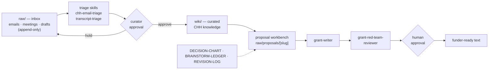

# CHH Cortex

**Start here on GitHub → [`CHH-ROADMAP.md`](CHH-ROADMAP.md)**

That file has everything Paul asked for: **contextual awareness**, **email population**, pain points, six layers, reviewer lessons / quality feedback cycle, tailored grant tool, and roadmap phases.

Plain markdown in git or Google Drive. Human approval gates. No PII/PHI in the shared vault.

## Quick links

| Who | Open |
|-----|------|
| **Paul / William** | [`CHH-ROADMAP.md`](CHH-ROADMAP.md) · [`CHH-DECISIONS.md`](CHH-DECISIONS.md) (file map) · [`CHH-DEPLOYMENT-OPTIONS.md`](CHH-DEPLOYMENT-OPTIONS.md) |
| **Manny (install)** | [`_system/CHH-INSTALL.md`](_system/CHH-INSTALL.md) · [`_system/CHH-PHASE1-PLAYBOOK.md`](_system/CHH-PHASE1-PLAYBOOK.md) |
| **See real grant complexity** | [`raw/proposals/demo-lsri-workbench-2026/DEMO-READ-ME-FIRST.md`](raw/proposals/demo-lsri-workbench-2026/DEMO-READ-ME-FIRST.md) |

## The map — how CHH Cortex works



Nothing moves from inbox to knowledge, or from draft to funder, without a human saying yes. Works in any AI workspace that opens a folder (Cursor, Claude Desktop, Antigravity, Codex) — memory is these files, not any single tool.

## First prompt

```
Read CHH-ROADMAP.md — explain contextual awareness and email population for CHH in plain language.
```

**Support:** Berktuğ Kubuk — berktug@heradigitalhealth.org
